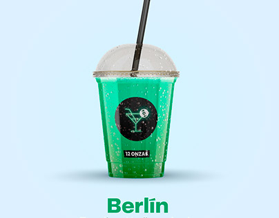
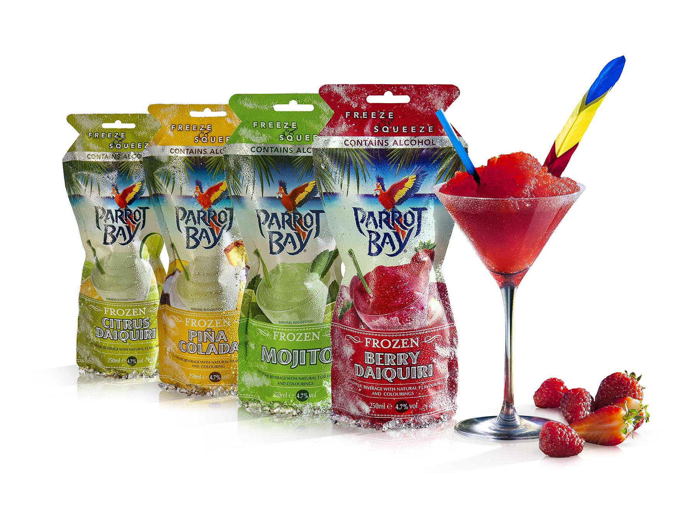

<!DOCTYPE html>
<html lang="es">
<head>
  <meta charset="UTF-8">
  <meta name="viewport" content="width=device-width, initial-scale=1.0">
  <meta name="description" content="Cocteles Granizados - Refresca tu día con los mejores cocteles granizados.">
  <title>Cocteles AMD</title>
  
</head>
<body>
  <header>
    

      
    

    <nav>
      <ul>
        <li><a href="#">Inicio</a></li>
        <li><a href="#">Menú</a></li>
        <li><a href="#">Acerca de</a></li>
        <li><a href="#">Contacto</a></li>
      </ul>
    </nav>
  </header>

  <main>
    <section class="hero">
      <h1>Bienvenido a Cocteles AMD</h1>
      
¡La frescura que necesitas en cada sorbo!

      <a href="#" class="cta-button">Descubre nuestros cocteles</a>
    </section>

    <section class="cocteles">
      <h2>Cocteles Granizados</h2>
      

        

          
          <h3>Granizado Tropical</h3>
          
Un mix de frutas frescas con un toque de menta.

        

        

          
          <h3>Limón Refrescante</h3>
          
El clásico sabor ácido y refrescante del limón, con un toque de fresa.

        

        

          
          <h3>Mango Enfocado</h3>
          
Un delicioso granizado de mango, perfecto para el calor.

        

      

    </section>
  </main>

  <footer>
    
&copy; 2025 Cocteles AMD. Todos los derechos reservados.

  </footer>
</body>
</html>

